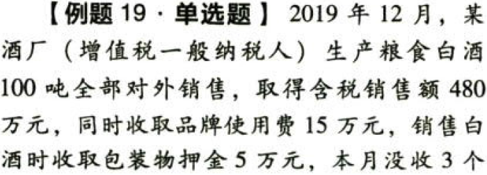
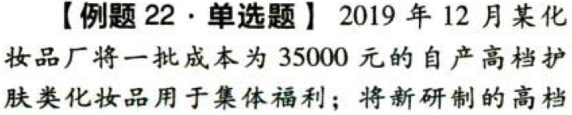
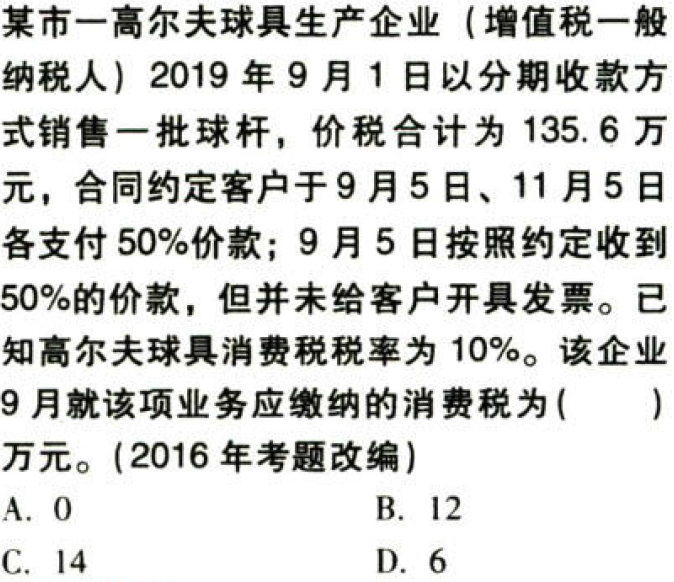
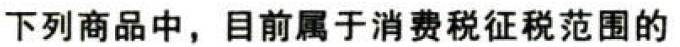
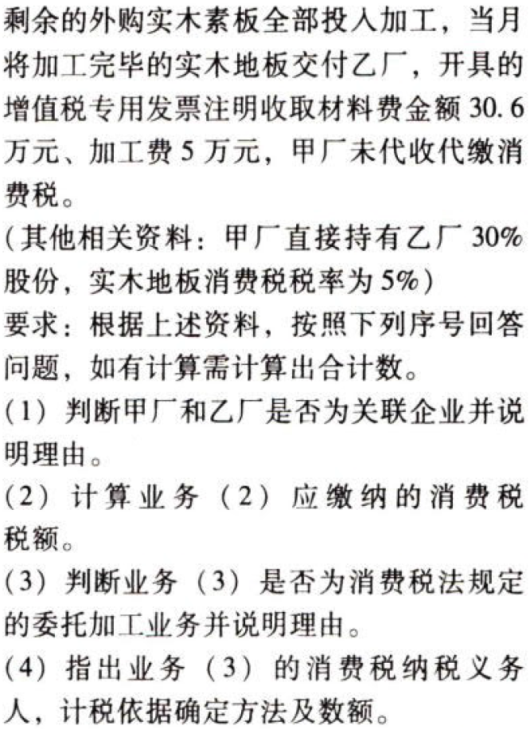

C03.消费税.本章真题

# 1. 题目

【答案】
[查看解析和答案](media/d5821585efc884bda5e71a13457428da.png.md)
# 2. 题目

【答案】
[查看解析和答案](media/7125b7b5e12e38595b3e929f0f6ebaf8.png.md)
# 3. 题目

【答案】
[查看解析和答案](media/b4337fae331d6b5e41c83359ad30d0e7.png.md)
# 4. 题目

【答案】
[查看解析和答案](media/81bb515a391a522f6046c69c80f2faa0.png.md)
# 5. 题目

【答案】
[查看解析和答案](media/a2956f1ec9a54ffc6613d2514c25bb98.png.md)
# 6. 题目

【答案】
[查看解析和答案](media/d4fb3ff3434c089f835079c75d6a85b7.png.md)
# 7. 题目

【答案】
[查看解析和答案](media/d822e22ca4aff2e6dc30203af72c68c5.png.md)
# 8. 题目

【答案】
[查看解析和答案](media/d380c2562095d9fa209b37db81a7616e.png.md)
# 9. 题目

【答案】
[查看解析和答案](media/c4e1c0cfeec2d219d4946d4187566d9e.png.md)
# 10. 题目

【答案】
[查看解析和答案](media/46843b95f37d9019024a64ba246dff7b.png.md)
# 11. 题目

【答案】
[查看解析和答案](media/cf4b5a9c94c6dfb977dba665ad05f1a7.png.md)
# 12. 题目

【答案】
[查看解析和答案](media/c96368225788b7cca4691341cf84c81a.png.md)
# 13. 题目

【答案】
[查看解析和答案](media/a54b7177949736401c1893e4ecf7fa0e.png.md)
# 14. 题目

【答案】
[查看解析和答案](media/47f1bba35a35265d3396fe6a0132222c.png.md)
# 15. 题目

【答案】
[查看解析和答案](media/52543d0fe79db8611ae1a7e12dc98014.png.md)
# 16. 题目

【答案】
[查看解析和答案](media/f172b15668c94df14413be6788243532.png.md)
# 17. 题目

【答案】
[查看解析和答案](media/ab53d2694249b02cea2730b9304d6b89.png.md)
# 18. 题目

【答案】
[查看解析和答案](media/aa075d3999657b1ea8d7d638dc2689f7.png.md)
# 19. 题目

【答案】
[查看解析和答案](media/bdedea0a846b8aec4976749a0405da27.png.md)
# 20. 题目

【答案】
[查看解析和答案](media/f0dd7f4cff12a9c36c68de2cd4a46fe1.png.md)
# 21. 题目

【答案】
[查看解析和答案](media/ff328f0bb2b0c9f814590deef9551683.png.md)
# 22. 题目

【答案】
[查看解析和答案](media/389125ae2392b7751bfcb0aea3407643.png.md)
# 23. 题目

【答案】
[查看解析和答案](media/978997b51b3f65d5daabcc91202aab9a.png.md)
# 24. 题目

【答案】
[查看解析和答案](media/b1164236e2b608c0f565a5f537b1f7a2.png.md)
# 25. 题目

【答案】
[查看解析和答案](media/b60a13265466d3d95c37a97684e4cadd.png.md)
# 26. 题目

【答案】
[查看解析和答案](media/5dbd0ba78d6008330f4f80b7744c948e.png.md)
# 27. 题目

【答案】
[查看解析和答案](media/63cdaabbf82a22d97fa2b1fc59e8069b.png.md)
# 28. 题目

【答案】
[查看解析和答案](media/f374fc0b894bce123a3af0c7ca398248.png.md)
# 29. 题目

【答案】
[查看解析和答案](media/e82f3cedabc4b800136b984a64d467e3.png.md)
# 30. 题目

【答案】
[查看解析和答案](media/45199faed69f334f72c1a2716192c5b9.png.md)
# 31. 题目

【答案】
[查看解析和答案](media/3fab880238b047e3e483b3c330e99263.png.md)
# 32. 题目

【答案】
[查看解析和答案](media/59ac06bbffaf47486cbcb90fa7c9fdf1.png.md)
# 33. 题目

【答案】
[查看解析和答案](media/2c2466f29da2db2106822353bf1b3f67.png.md)
# 34. 题目

【答案】
[查看解析和答案](media/7fe0a3ce11c630acf9e97a7097f1f68d.png.md)
# 35. 题目

【答案】
[查看解析和答案](media/935910ece82ee83b0dac26e800fa9f15.png.md)
# 36. 题目

【答案】
[查看解析和答案](media/6210424e860cc72ba40a6d8bec0da8b6.png.md)
# 37. 题目

【答案】
[查看解析和答案](media/50cc2bed7b0d0a1af02a5568d8a6b153.png.md)
# 38. 题目

【答案】
[查看解析和答案](media/1c883850c5752993b7cd1040d1834d4b.png.md)
# 39. 题目

【答案】
[查看解析和答案](media/131c1f2633a6499e69a7b097484c6e30.png.md)
# 40. 题目（单选）

【答案】
[查看解析和答案](media/4ba6a0d5bfeedc2e85f2ea020cb9bc77.png.md)
# 41. 题目（单选）

【答案】
[查看解析和答案](media/555d5bbb4ce67565bae8080ac0aa41f5.png.md)
# 42. 题目（单选）

【答案】
[查看解析和答案](media/ae34ce9540a813835bad5de9a0b3edd1.png.md)
# 43. 题目（单选）

【答案】
[查看解析和答案](media/27209dc7416a44550af9430417560ea5.png.md)
# 44. 题目（单选）

【答案】
[查看解析和答案](media/c580d7a31b9f596e04e4446a6d87f42a.png.md)
# 45. 题目（多选）

【答案】
[查看解析和答案](media/2647d72fcd35967d2aa56f14ce7261f6.png.md)
# 46. 题目（多选）

【答案】
[查看解析和答案](media/cde66d4fd662edab8696c73100c57058.png.md)
# 47. 题目（多选）

【答案】
[查看解析和答案](media/f5fe8a3e7e880a40a5eef2533e2aed6e.png.md)
# 48. 题目（多选）

【答案】
[查看解析和答案](media/604ad8b237ae08738952cdfe06be7aff.png.md)
# 49. 题目（多选）

【答案】
[查看解析和答案](media/0a50ede6ade37e3cd1e6c9a8ccdc354c.png.md)
# 50. 题目

【答案】
[查看解析和答案](media/b1b91ff395f80c9379e80090a7ab010b.png.md)
# 51. 题目

【答案】
[查看解析和答案](media/68a922f92249b198c8645ffec187ecbc.png.md)
# 52. 题目

【答案】
[查看解析和答案](media/eca6897f78567561461bf706e453bdea.png.md)
# 53. 题目

【答案】
[查看解析和答案](media/c4c7124ea532b3a889c0e1d4c8d8edd8.png.md)
# 54. 题目

【答案】
[查看解析和答案](media/b2644aa075bc679dc71b15ba45343fad.png.md)
# 55. 题目

【答案】
[查看解析和答案](media/33e708f9dd7ca42d372de6fb2c0a9cf8.png.md)

