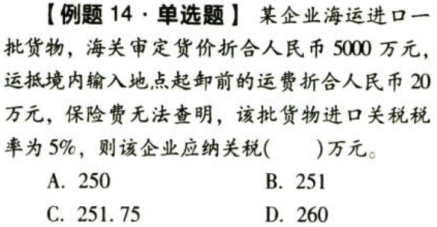
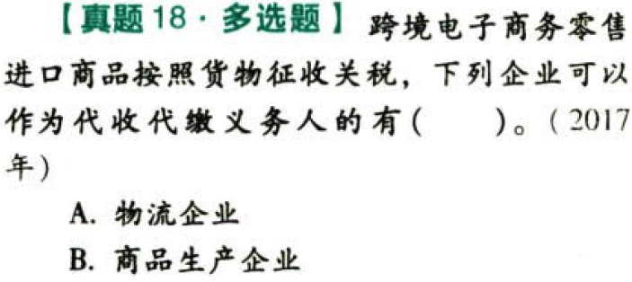
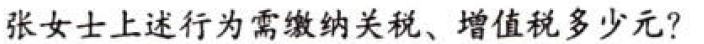

关税.本章真题

# 1. 题目

【答案】
[查看解析和答案](media/ede8aff19da2a5da28247e2e3e5218fc.png.md)
# 2. 题目

【答案】
[查看解析和答案](media/e7078fd4f6de2da51f6ecb709dcc343d.png.md)
# 3. 题目

【答案】
[查看解析和答案](media/a78148161255cce60631fa63fc789a3d.png.md)
# 4. 题目

【答案】
[查看解析和答案](media/7d6bc415b65610c3e36642d450527751.png.md)
# 5. 题目

【答案】
[查看解析和答案](media/82ab5839c430c9c93dabdfd65d100d62.png.md)
# 6. 题目

【答案】
[查看解析和答案](media/79ceda1de86070075c9e807aa27cc2df.png.md)
# 7. 题目

【答案】
[查看解析和答案](media/9d2e4a9fad27488c4b2fa19129e00495.png.md)
# 8. 题目

【答案】
[查看解析和答案](media/600c49373bcc8516245998700e79823b.png.md)
# 9. 题目

【答案】
[查看解析和答案](media/92bb82ca08945a16f231751d891f4b27.png.md)
# 10. 题目

【答案】
[查看解析和答案](media/f9ecee4022aeb5f5603d8e080e5c6ebc.png.md)
# 11. 题目

【答案】
[查看解析和答案](media/7897bce65ba584f5b32beb5f0d9182e7.png.md)
# 12. 题目

【答案】
[查看解析和答案](media/996be55012b6526dc0d63520c20a565f.png.md)
# 13. 题目

【答案】
[查看解析和答案](media/93ee7b266088fc61daea53e9920e0cd3.png.md)
# 14. 题目

【答案】
[查看解析和答案](media/3f1966f329bd0de1448bf9b5d8df7b27.png.md)
# 15. 题目

【答案】
[查看解析和答案](media/83cf7c4244bd4a25508fd513d55453a4.png.md)
# 16. 题目

【答案】
[查看解析和答案](media/7d87128dddfbedf2acfa930d06bb0b2e.png.md)
# 17. 题目

【答案】
[查看解析和答案](media/b24e1ea7a5dc509196410b50104e944c.png.md)
# 18. 题目

【答案】
[查看解析和答案](media/0e227bf4f59cf3eab522e48e8eeeedfa.png.md)
# 19. 题目

【答案】
[查看解析和答案](media/8a0165697d78406d6c2a051e4324b8b5.png.md)
# 20. 题目

【答案】
[查看解析和答案](media/e5a7a12df243fd51cb3292d2eb47e650.png.md)
# 21. 题目

【答案】
[查看解析和答案](media/e7ab550abfbee106423b92e93bf1d408.png.md)
# 22. 题目

【答案】
[查看解析和答案](media/49932d51810181bca36037c977296438.png.md)
# 23. 题目

【答案】
[查看解析和答案](media/6359ae419e41ab914a9225f7c4fadb54.png.md)
# 24. 题目

【答案】
[查看解析和答案](media/3061ffab34d1edc354cb0c73b9ba117f.png.md)
# 25. 题目

【答案】
[查看解析和答案](media/541cd057b0d381e9934428c80bbc6192.png.md)
# 26. 题目（单选）

【答案】
[查看解析和答案](media/78a045871506e5e8763c1c3760c34296.png.md)
# 27. 题目（单选）

【答案】
[查看解析和答案](media/406652b26cbf389bf51e8f8e56279c3a.png.md)
# 28. 题目（多选）

【答案】
[查看解析和答案](media/cdf77571c9c5f9b7539e48cb384da0f1.png.md)
# 29. 题目（多选）

【答案】
[查看解析和答案](media/edc39f2d63b18f20b3040139287e696a.png.md)
# 30. 题目（多选）

【答案】
[查看解析和答案](media/fbc4cc436971d5f00aa97d313874c3f2.png.md)
# 31. 题目（多选）

【答案】
[查看解析和答案](media/e45e038cd712f740142172f3582a14f1.png.md)
# 32. 题目

【答案】
[查看解析和答案](media/cb30a506478eb05436d32ca6f13b0588.png.md)

