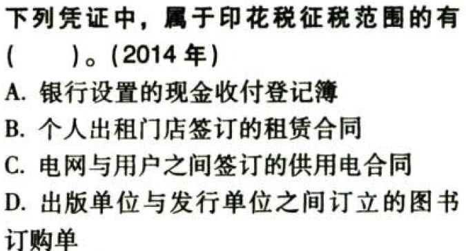

印花税.本章真题

# 1. 题目

【答案】
[查看解析和答案](media/039151f4c25b70f934bd24d61651c831.png.md)
# 2. 题目

【答案】
[查看解析和答案](media/c9ba8684eec880dfe102fc66a682480e.png.md)
# 3. 题目

【答案】
[查看解析和答案](media/45e50358b197e3016f59d8ddd8a76d3d.png.md)
# 4. 题目

【答案】
[查看解析和答案](media/9808257ffdd2893400dd75b0501b9cbf.png.md)
# 5. 题目

【答案】
[查看解析和答案](media/ee1c5de1929f9110bfdfb5a61237abb9.png.md)
# 6. 题目

【答案】
[查看解析和答案](media/b4a758614463f2a8ea15f2b3da232623.png.md)
# 7. 题目

【答案】
[查看解析和答案](media/328fff541ae69a3798d4284b012bb55e.png.md)
# 8. 题目

【答案】
[查看解析和答案](media/df48a16488e71c7faec58744982e3751.png.md)
# 9. 题目

【答案】
[查看解析和答案](media/de1bb15f45df30a3d9e7c80d2588cd8c.png.md)
# 10. 题目

【答案】
[查看解析和答案](media/e69b6f2548915a3545394b7d196ffae6.png.md)
# 11. 题目

【答案】
[查看解析和答案](media/1240638b9d87e6974babedcc1788a6ff.png.md)
# 12. 题目

【答案】
[查看解析和答案](media/f421bec1ce14059c529a50386de9a8b2.png.md)
# 13. 题目

【答案】
[查看解析和答案](media/9038fe003c743fc9afd15a9d55b2e1c6.png.md)
# 14. 题目

【答案】
[查看解析和答案](media/2f1a16a3655e9949ed30592ca53d800a.png.md)
# 15. 题目

【答案】
[查看解析和答案](media/457387cca2474ce51fc4e371c93e4778.png.md)
# 16. 题目

【答案】
[查看解析和答案](media/c2bfcd599455a7f3b6c13f14d17cbc6b.png.md)
# 17. 题目

【答案】
[查看解析和答案](media/8257b084710a6bbf505f2969c02e9ade.png.md)
# 18. 题目（单选）

【答案】
[查看解析和答案](media/e23479ddda2f586dbae47fea2139126f.png.md)
# 19. 题目（多选）

【答案】
[查看解析和答案](media/4d6ca71e616613eb909efef8fa75caaf.png.md)
# 20. 题目（多选）

【答案】
[查看解析和答案](media/a7e5496d3643dc7e42d6a5d1bc312288.png.md)
# 21. 题目

【答案】
[查看解析和答案](media/a9222a2c939a7ee210e1810829593e9c.png.md)
# 22. 题目

【答案】
[查看解析和答案](media/aecb5fdf2f8587d425399202430d3e51.png.md)
# 23. 题目

【答案】
[查看解析和答案](media/fa5c0ee55a8671c4a63022cda937f200.png.md)
# 24. 题目

【答案】
[查看解析和答案](media/8cc938a708fc87b8ba01db263cec6615.png.md)

