城市维护建设税.本章真题

# 1. 题目

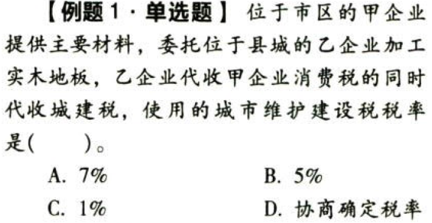

【答案】
[查看解析和答案](media/33af13109b74cd35ce14af076a65269b.png.md)
# 2. 题目

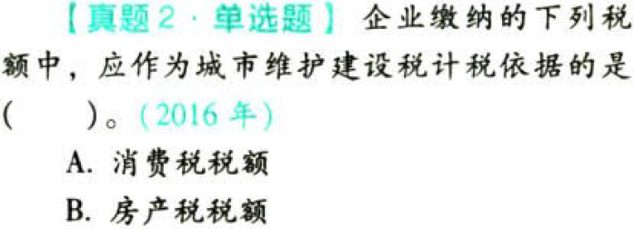

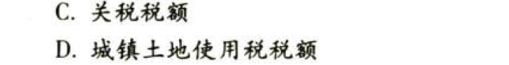

【答案】
[查看解析和答案](media/0c939a2286760f9c3e452209db04dcde.png.md)
# 3. 题目

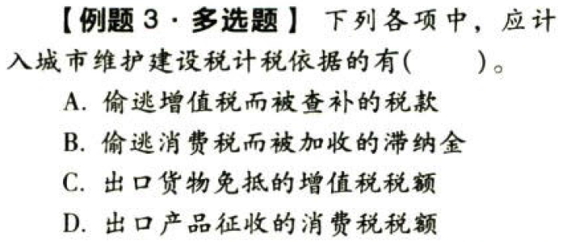

【答案】
[查看解析和答案](media/a07d0c4ab1a866439f7edc1f7e1385dc.png.md)
# 4. 题目

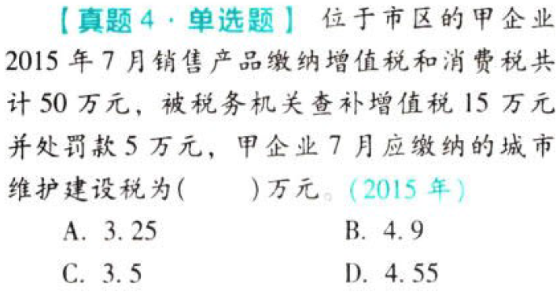

【答案】
[查看解析和答案](media/69c37840450db05a8429a5044de3464e.png.md)
# 5. 题目

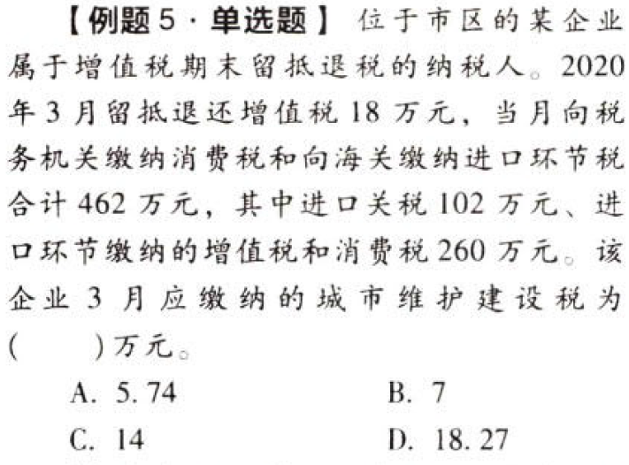

【答案】
[查看解析和答案](media/5a12558892e3aa455b9f82df9d6b31da.png.md)
# 6. 题目

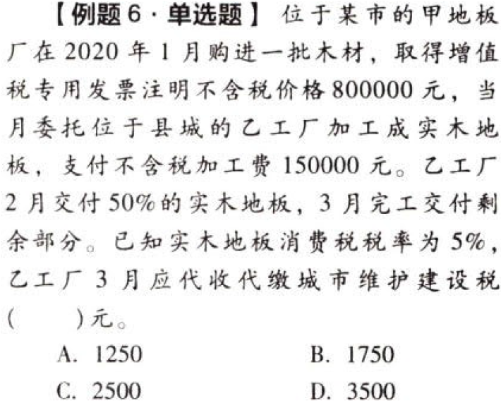

【答案】
[查看解析和答案](media/3f9585f002285cb5e825047fa64a4a29.png.md)
# 7. 题目

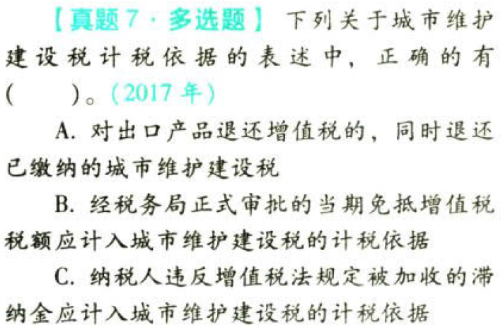

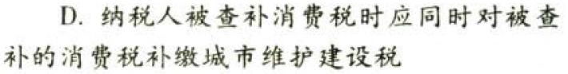

【答案】
[查看解析和答案](media/dc5e2f333745c5ed8b409d1b8f0fc443.png.md)
# 8. 题目

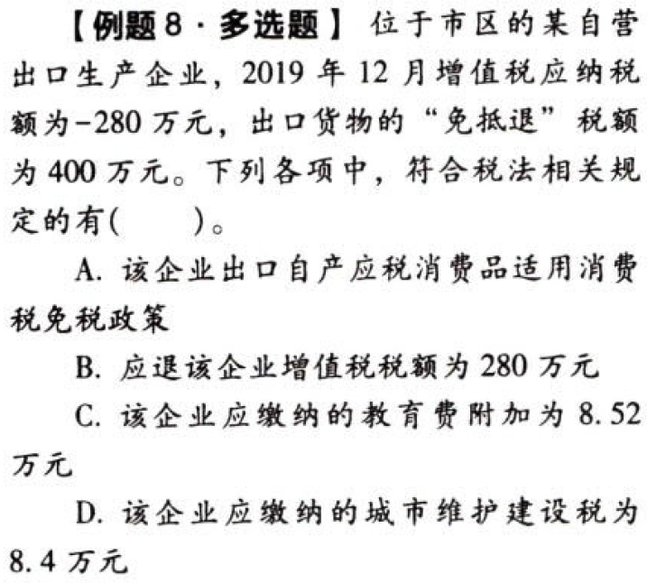

【答案】
[查看解析和答案](media/c18673d6a2eaf47d413ffb9f9110e38f.png.md)
# 9. 题目

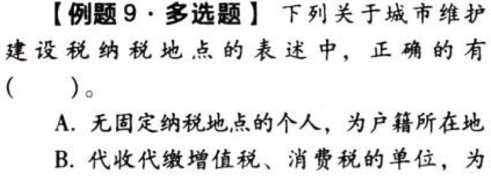

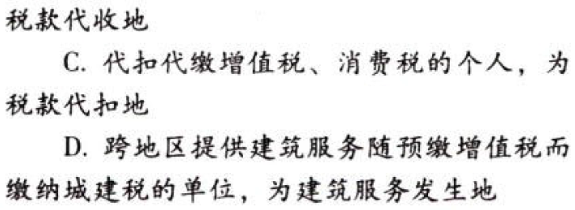

【答案】
[查看解析和答案](media/b9d0d38234b7737977622e8bc505bf87.png.md)
# 10. 题目

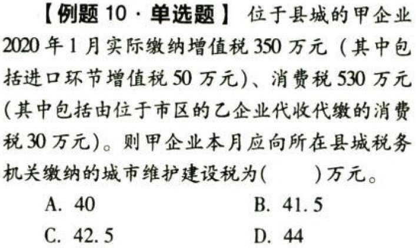

【答案】
[查看解析和答案](media/dae3817662564dd18733a49ea8fb979d.png.md)
# 11. 题目

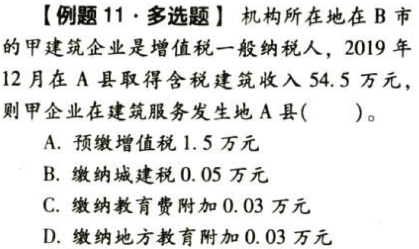

【答案】
[查看解析和答案](media/727a1e6f68604be3c5493d015d90d56d.png.md)
# 12. 题目（单选）

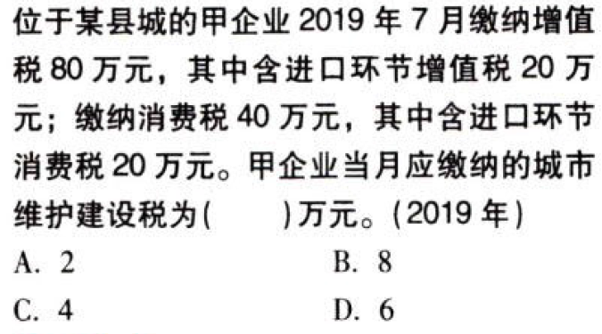

【答案】
[查看解析和答案](media/bf9f602f6196f13b695a0f84a81e38aa.png.md)
# 13. 题目（单选）

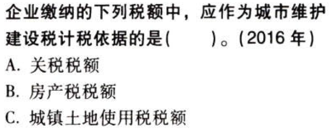

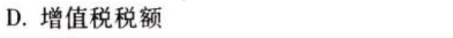

【答案】
[查看解析和答案](media/ad68e18ac062b04a5f7b41b8583acff5.png.md)
# 14. 题目（多选）

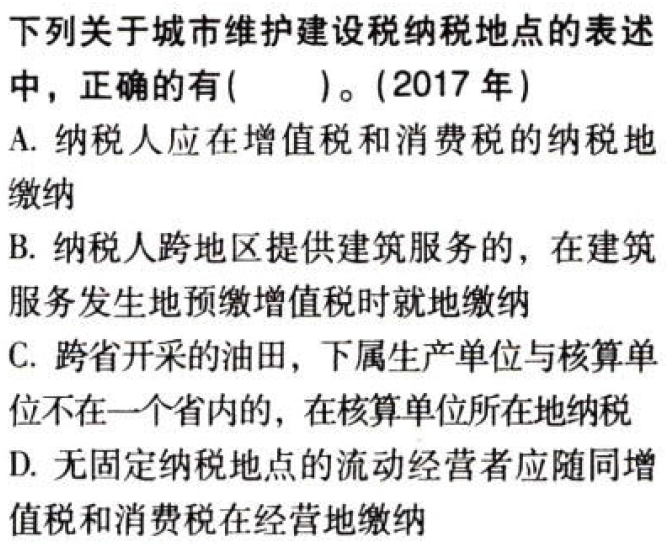

【答案】
[查看解析和答案](media/cefc1a86ade942e5d186cf2cc30bfe02.png.md)

