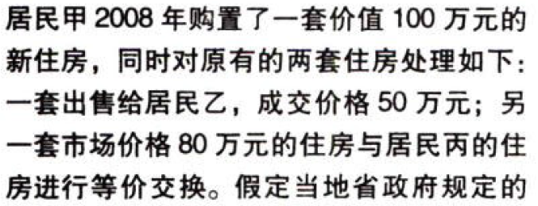

契税.本章真题

# 1. 题目

【答案】
[查看解析和答案](media/1e11782e2b8230c34e52aba1e0020f0d.png.md)
# 2. 题目

【答案】
[查看解析和答案](media/ade5f4d340293454ce2c6b04b27c90a4.png.md)
# 3. 题目

【答案】
[查看解析和答案](media/819195a45af6323344ab9b6d92da20b5.png.md)
# 4. 题目

【答案】
[查看解析和答案](media/02ce624dc73ae3c27fd3e230ceb4c0f0.png.md)
# 5. 题目

【答案】
[查看解析和答案](media/8afbcc0a1cee3773a30e83f0a0fc16a8.png.md)
# 6. 题目

【答案】
[查看解析和答案](media/a775dd4477633519d1ad60316938bb51.png.md)
# 7. 题目

【答案】
[查看解析和答案](media/1dd2d4059d4b2cb86957e78581645471.png.md)
# 8. 题目

【答案】
[查看解析和答案](media/142dcefb656956ff6461952d1b47ee3f.png.md)
# 9. 题目

【答案】
[查看解析和答案](media/940a9ee1132ff455f2850d75dbade1c7.png.md)
# 10. 题目

【答案】
[查看解析和答案](media/dd9fa8dcbaaf30e15ac412f1548db4dd.png.md)
# 11. 题目

【答案】
[查看解析和答案](media/248f18791b92c0ebe228e132cd4d7a51.png.md)
# 12. 题目

【答案】
[查看解析和答案](media/0b3acec77f261c01c0be4c2d4bafe660.png.md)
# 13. 题目（多选）

【答案】
[查看解析和答案](media/05a46c52e5428c81d10113105f5da2e5.png.md)
# 14. 题目（多选）

【答案】
[查看解析和答案](media/acd5f241ae1db3582e6c67eb530b5e60.png.md)

