房产税.本章真题

# 1. 题目

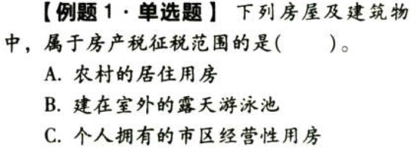

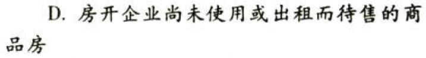

【答案】
[查看解析和答案](media/118b79b5acee26cfe62d59715d883f27.png.md)
# 2. 题目

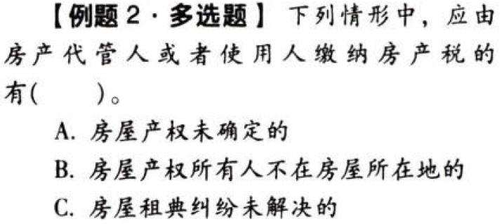

【答案】
[查看解析和答案](media/147117737d2bbb6f79be2a462cf2c1ac.png.md)
# 3. 题目

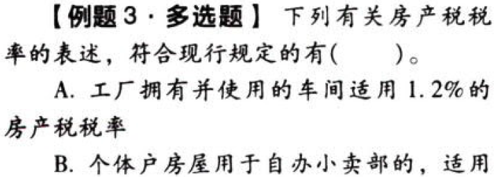

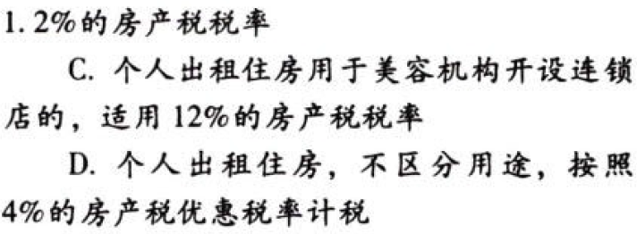

【答案】
[查看解析和答案](media/045c068f52a04b4ee9ee6ff9144f1360.png.md)
# 4. 题目

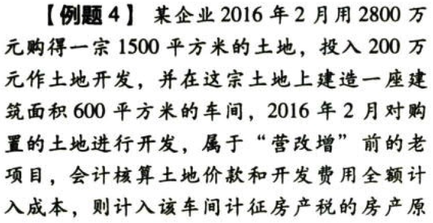

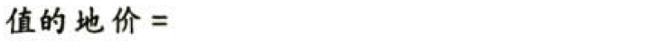

【答案】
[查看解析和答案](media/6006773c2b8dff5257d41423c1e00e7f.png.md)
# 5. 题目

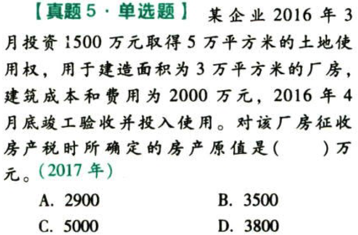

【答案】
[查看解析和答案](media/9d7b2a7b4ac58934d7e460ac3329a0a2.png.md)
# 6. 题目

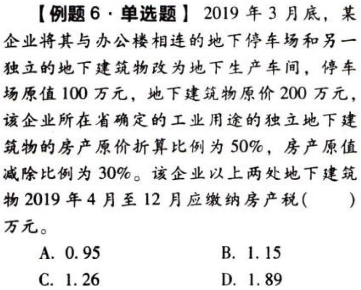

【答案】
[查看解析和答案](media/db211d0329a19624679d48bb3a5826b1.png.md)
# 7. 题目

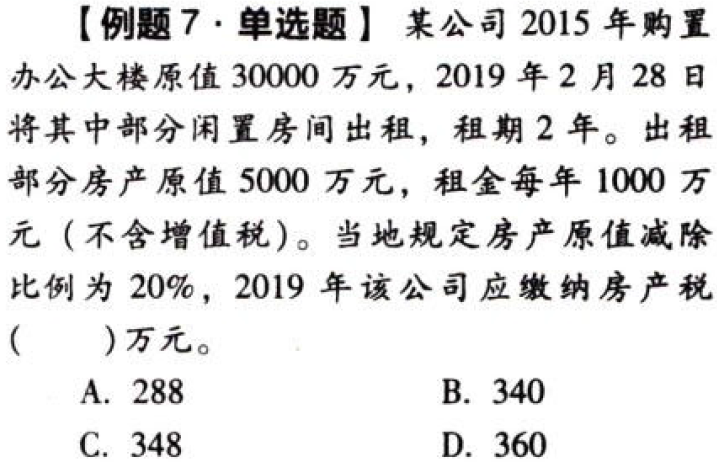

【答案】
[查看解析和答案](media/7b353242135f557936ed1398cdb0088f.png.md)
# 8. 题目

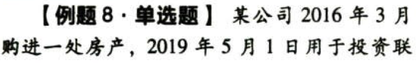

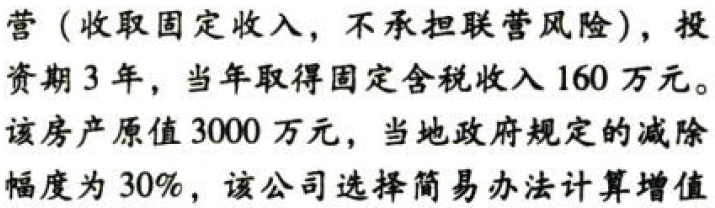

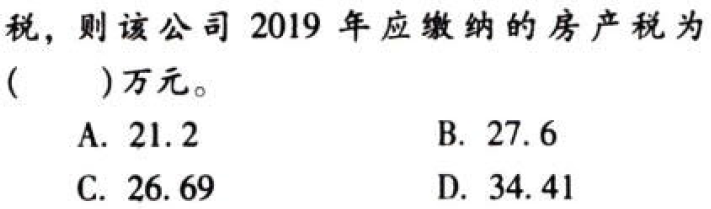

【答案】
[查看解析和答案](media/9c1dfad67b43c0adb163376f36765e2d.png.md)
# 9. 题目

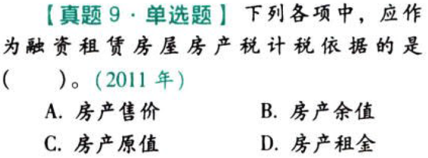

【答案】
[查看解析和答案](media/caff1c1e46ced087903c7fb9689c2507.png.md)
# 10. 题目

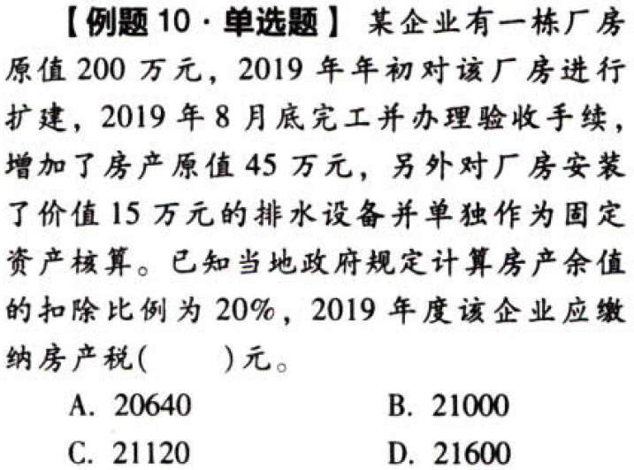

【答案】
[查看解析和答案](media/929788c93dcc6495cfc6f149a87f9203.png.md)
# 11. 题目

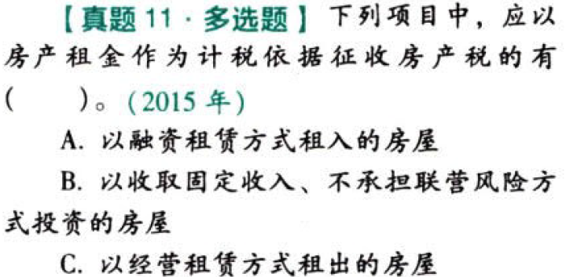

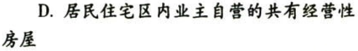

【答案】
[查看解析和答案](media/bccc11db3af329a507b927f3351a2408.png.md)
# 12. 题目

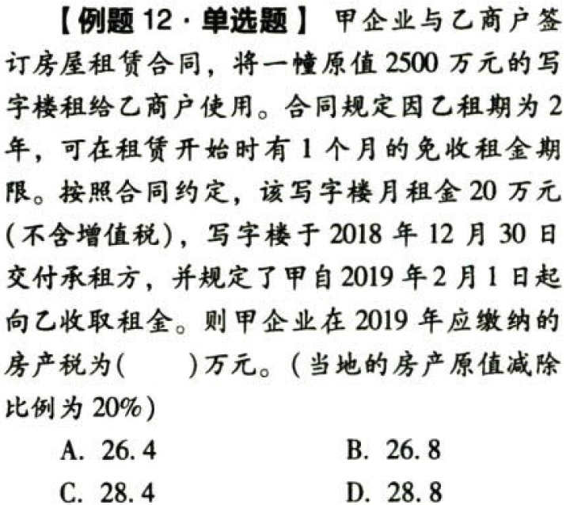

【答案】
[查看解析和答案](media/8de24e4adfc21614417e639f5f9e53e0.png.md)
# 13. 题目

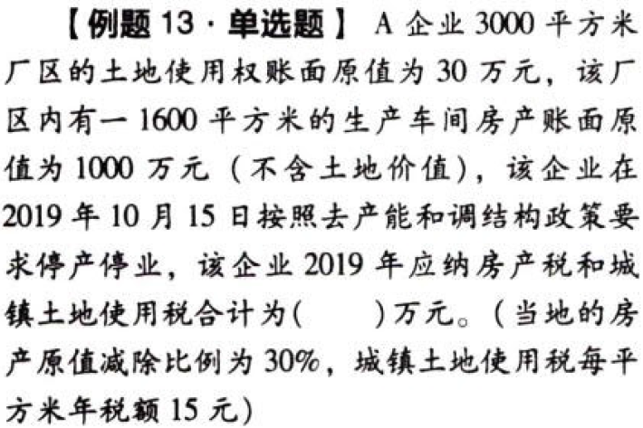

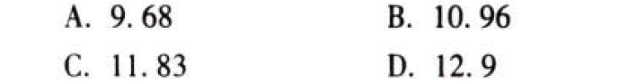

【答案】
[查看解析和答案](media/daedc0789effdb88bfd58b344120a1b3.png.md)
# 14. 题目

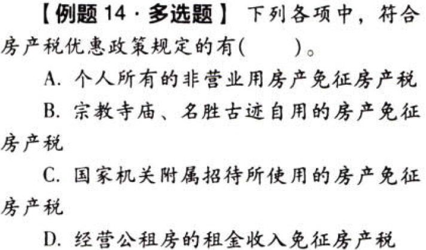

【答案】
[查看解析和答案](media/125c53c4953af582685990fc0e311645.png.md)
# 15. 题目

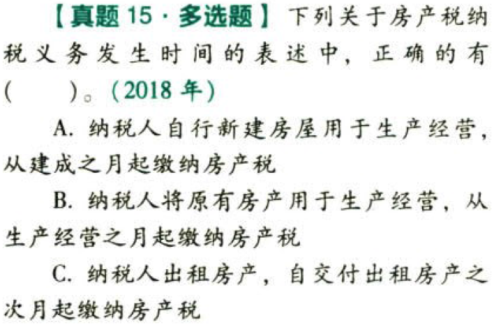

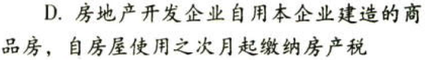

【答案】
[查看解析和答案](media/01f92da22defec820c6720af08f912db.png.md)
# 16. 题目

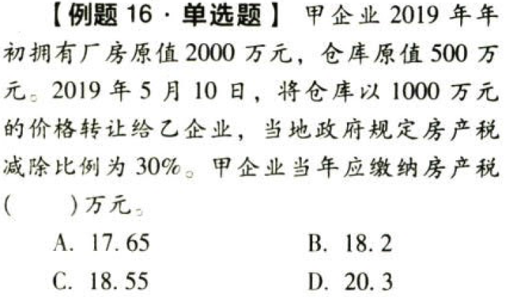

【答案】
[查看解析和答案](media/497d571b2f28681bc19cb888c70f3d0c.png.md)
# 17. 题目（单选）

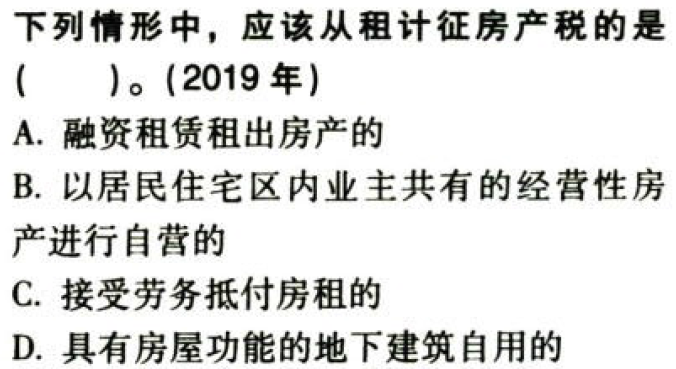

【答案】
[查看解析和答案](media/fd4ecb6df97be4206337697de898ebe3.png.md)
# 18. 题目（单选）

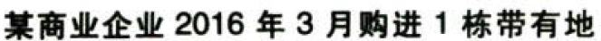

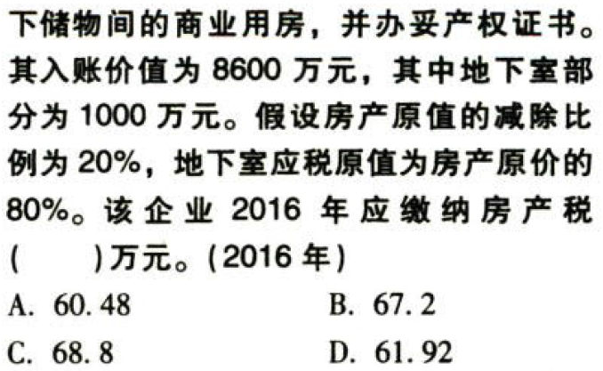

【答案】
[查看解析和答案](media/985f9282768c3d557b53409d74ad8378.png.md)
# 19. 题目（单选）

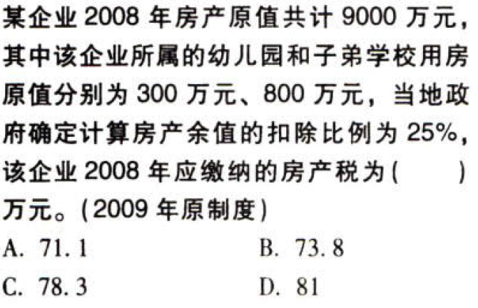

【答案】
[查看解析和答案](media/33b36d9b75d420658177aeb6541e33a8.png.md)
# 20. 题目（单选）

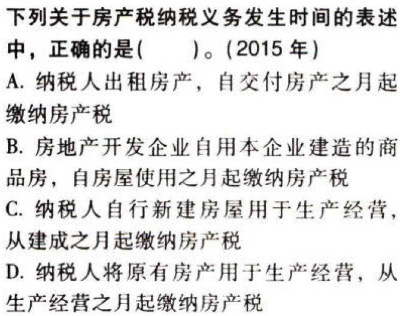

【答案】
[查看解析和答案](media/92f5f71d5c7fb45d6da517b0a1487c4a.png.md)
# 21. 题目（多选）

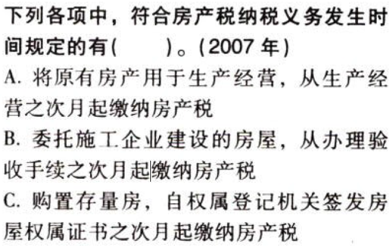

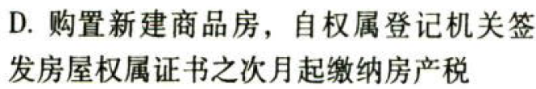

【答案】
[查看解析和答案](media/6106e57442ee1f1a8c2f538061d0d7a5.png.md)

