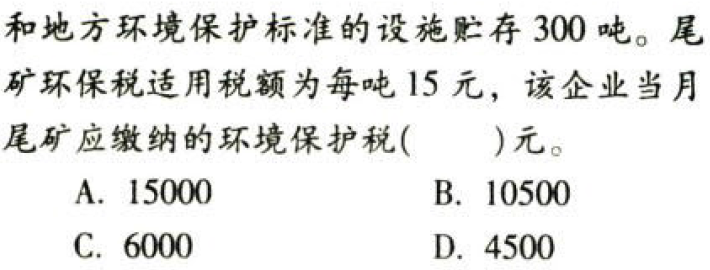

环境保护税法.本章真题

# 1. 题目

【答案】
[查看解析和答案](media/0fc9a063c62321c227b301eecf769d4f.png.md)
# 2. 题目

【答案】
[查看解析和答案](media/28096a7e55401c0f605290c51b059e9e.png.md)
# 3. 题目

【答案】
[查看解析和答案](media/418371c04b94c80bd33e41afb0627aa9.png.md)
# 4. 题目

【答案】
[查看解析和答案](media/f433772e5e4437b2cf2c8090b1b81cfa.png.md)
# 5. 题目

【答案】
[查看解析和答案](media/f9b8ab60da32102af236924032fe0ebf.png.md)
# 6. 题目

# 7. 题目

【答案】
[查看解析和答案](media/a02145d6d4ac6c6d6e4fdea75f345b94.png.md)
# 8. 题目

【答案】
[查看解析和答案](media/0c1642bf3474b213a72c46232be4a66d.png.md)
# 9. 题目

【答案】
[查看解析和答案](media/c3fb4809ffc84dcf3e50baf761a388b8.png.md)
# 10. 题目

【答案】
[查看解析和答案](media/3b0059d4e4e69a959b89a4077cf68b27.png.md)
# 11. 题目

【答案】
[查看解析和答案](media/7dc3fbe2f7c63eeb8b4100a5cf08f1d1.png.md)
# 12. 题目

【答案】
[查看解析和答案](media/d49a8a5d45eb91a9d9cbf714e683d064.png.md)
# 13. 题目

【答案】
[查看解析和答案](media/1309b4539f013ada2f5c0673d7b057a6.png.md)
# 14. 题目（单选）

【答案】
[查看解析和答案](media/ac44ba04313edca7f2a05264908adac9.png.md)

