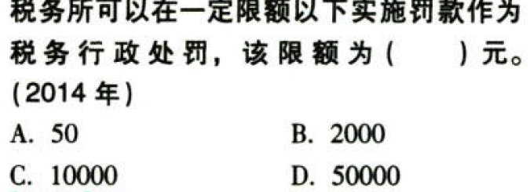

税务行政法制.本章真题

# 1. 题目

【答案】
[查看解析和答案](media/e7af7fd29ea0bd47424566eb9d553363.png.md)
# 2. 题目

【答案】
[查看解析和答案](media/ebe58001f715f57a8c775492478b8b91.png.md)
# 3. 题目

【答案】
[查看解析和答案](media/863eec63d4d52432e3ffeabfda62ead6.png.md)
# 4. 题目

【答案】
[查看解析和答案](media/edde7dbb18a334d50e5b1bc2158c2323.png.md)
# 5. 题目

【答案】
[查看解析和答案](media/d5dbd1bcd7921bfa85a129900b23ab96.png.md)
# 6. 题目

【答案】
[查看解析和答案](media/c9f377d4b4fe6d33c905ee9f0e92b0fc.png.md)
# 7. 题目

【答案】
[查看解析和答案](media/e309c2ae100596250b9819de86185817.png.md)
# 8. 题目

【答案】
[查看解析和答案](media/bc395a66c41ee9a4155da21a97ed503f.png.md)
# 9. 题目

【答案】
[查看解析和答案](media/59c8bd446054e1448985cfe7772f001d.png.md)
# 10. 题目

【答案】
[查看解析和答案](media/4e90e18bed4d90a21d892af9076a35b9.png.md)
# 11. 题目

【答案】
[查看解析和答案](media/95def9a5958856620b9aeec2756966ce.png.md)
# 12. 题目

【答案】
[查看解析和答案](media/59fc17e34540e528fd75058d154c95a5.png.md)
# 13. 题目

【答案】
[查看解析和答案](media/6c4a8f0762c9c3c4fb9722e99f3ccb5a.png.md)
# 14. 题目

【答案】
[查看解析和答案](media/4e4e2c8b8f1b35cfb83731c23a12ed1f.png.md)
# 15. 题目

【答案】
[查看解析和答案](media/bfa144a54cf6735d6b1c030d054dcfbf.png.md)
# 16. 题目

【答案】
[查看解析和答案](media/0b78482601705ce6333a37872ac5b55e.png.md)
# 17. 题目

【答案】
[查看解析和答案](media/535b69dfa08e01c5530b7be046f9e8c3.png.md)
# 18. 题目

【答案】
[查看解析和答案](media/81af8ba5baff2a8980a71a9e87088ef3.png.md)
# 19. 题目

【答案】
[查看解析和答案](media/0050fc5db19643e48db774469a7a61a5.png.md)
# 20. 题目

【答案】
[查看解析和答案](media/9e17d4ab536ffe55ef7b6e5fcd991ee2.png.md)
# 21. 题目

【答案】
[查看解析和答案](media/57aac8f8fadc4d4379a41e9df32d1d15.png.md)
# 22. 题目

【答案】
[查看解析和答案](media/0128c6e3dd2e008921de086da254fc99.png.md)
# 23. 题目

【答案】
[查看解析和答案](media/76c06d6033431713c76cf7644a55b0a7.png.md)
# 24. 题目

【答案】
[查看解析和答案](media/0229095375392f37f486989aa96bf00d.png.md)
# 25. 题目

【答案】
[查看解析和答案](media/8ee4c026d6f0bb23c2281aae0a2540f1.png.md)
# 26. 题目

【答案】
[查看解析和答案](media/393b410448830a46441d5611492e8e02.png.md)
# 27. 题目

【答案】
[查看解析和答案](media/0020099612534ffb1995a242bcfd2e4b.png.md)
# 28. 题目

【答案】
[查看解析和答案](media/81e3f64077c59690ec2a664d013a45cc.png.md)
# 29. 题目

【答案】
[查看解析和答案](media/354246dad6505f96cc2bb4155b8eb4d6.png.md)
# 30. 题目（单选）

【答案】
[查看解析和答案](media/4aca2ac511ebf2840362205991027b93.png.md)
# 31. 题目（单选）

【答案】
[查看解析和答案](media/ad254722f98b3e1bf3821c466b64971c.png.md)
# 32. 题目（单选）

【答案】
[查看解析和答案](media/d1cd81094e84aa445502997b520f11e8.png.md)
# 33. 题目（多选）

【答案】
[查看解析和答案](media/910ee7b682c1f8bf0d5fc7172ac3c758.png.md)
# 34. 题目（多选）

【答案】
[查看解析和答案](media/7573bc2714370584fa0d90ae7a6b0e37.png.md)
# 35. 题目（多选）

【答案】
[查看解析和答案](media/4b5b3ae6bea2739bbe29cf66c548a6ce.png.md)

