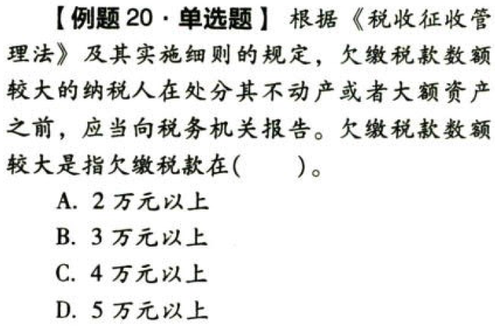
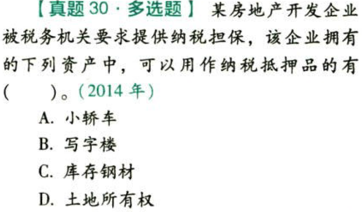

税收征收管理法.本章真题

# 1. 题目

【答案】
[查看解析和答案](media/8da9cf974af663b918632aedf626c72a.png.md)
# 2. 题目

【答案】
[查看解析和答案](media/8b08bd84ffb960a3be5760bb56989c41.png.md)
# 3. 题目

【答案】
[查看解析和答案](media/77ba77dd002f45145755c28d1435c54f.png.md)
# 4. 题目

【答案】
[查看解析和答案](media/0fc08235d229de02933d2955763dd09e.png.md)
# 5. 题目

【答案】
[查看解析和答案](media/a041feb0da08ab6b548b7dfb3537e1c8.png.md)
# 6. 题目

【答案】
[查看解析和答案](media/571ea4af4e9ad923507453f8d5912030.png.md)
# 7. 题目

【答案】
[查看解析和答案](media/c64b39ee84aa74626c6f6f69bb6bbf43.png.md)
# 8. 题目

【答案】
[查看解析和答案](media/aa2e3ad78f869a8746fd6dca6bdd8d33.png.md)
# 9. 题目

【答案】
[查看解析和答案](media/fece3cf6fc09e9541b5193df14b08be0.png.md)
# 10. 题目

【答案】
[查看解析和答案](media/b76613f328f07ad9e35bd8642884bddf.png.md)
# 11. 题目

【答案】
[查看解析和答案](media/f11ab97ac4b3ac147812b2de979ce9c6.png.md)
# 12. 题目

【答案】
[查看解析和答案](media/57454fc557c9336a6560a616864cbaa1.png.md)
# 13. 题目

【答案】
[查看解析和答案](media/141dc5602bf95e3cd431fa74fc245dc0.png.md)
# 14. 题目

【答案】
[查看解析和答案](media/47318b906f798da4a37cdd0250bb9518.png.md)
# 15. 题目

【答案】
[查看解析和答案](media/09087b07cfe0861613bf65961273effc.png.md)
# 16. 题目

【答案】
[查看解析和答案](media/87f21e436a9b25690bac3f9f1dcac304.png.md)
# 17. 题目

【答案】
[查看解析和答案](media/3f718170c85b7e11d52a31b935e87f7b.png.md)
# 18. 题目

【答案】
[查看解析和答案](media/cfc8ad68dee1ef927fb31539778bd80d.png.md)
# 19. 题目

【答案】
[查看解析和答案](media/1d291d0c5a64a44a01946d850ce3c75c.png.md)
# 20. 题目

【答案】
[查看解析和答案](media/f275ca43c2b4721c4eb80ac0059860ec.png.md)
# 21. 题目

【答案】
[查看解析和答案](media/53a892a6e62acf0f1f8dcccd657ce55d.png.md)
# 22. 题目

【答案】
[查看解析和答案](media/3fb21c027160db84096ceac21168024a.png.md)
# 23. 题目

【答案】
[查看解析和答案](media/3bd8f3f246b390a01aa81042ffbdfe40.png.md)
# 24. 题目

【答案】
[查看解析和答案](media/3f4cf81e7e0c737b2b6f513d1c00fb45.png.md)
# 25. 题目

【答案】
[查看解析和答案](media/e05b220e05dbea54331624dacaffa722.png.md)
# 26. 题目

【答案】
[查看解析和答案](media/5be12c981e984480d8867377345421c3.png.md)
# 27. 题目

【答案】
[查看解析和答案](media/cdbf428ef5ba673a9ea35d1e3704f385.png.md)
# 28. 题目

【答案】
[查看解析和答案](media/2f4c0dea4568d9aa46cdbf7566ea7c26.png.md)
# 29. 题目

【答案】
[查看解析和答案](media/63d180f2830ac494641e4a07f0571c82.png.md)
# 30. 题目

【答案】
[查看解析和答案](media/cb0767dd2a395914edf7e987b0f6a1f3.png.md)
# 31. 题目

【答案】
[查看解析和答案](media/191f18c142e30631c07224792e1fe9b4.png.md)
# 32. 题目

【答案】
[查看解析和答案](media/aa0e9a9ad1b440f025d53ca6fb3ce04b.png.md)
# 33. 题目

【答案】
[查看解析和答案](media/5e98716e2fa4d519f829aea9d4ece03e.png.md)
# 34. 题目

【答案】
[查看解析和答案](media/28d5e8cd25a8cb84c1c55ae9696f0fce.png.md)
# 35. 题目（单选）

【答案】
[查看解析和答案](media/2e309162c825afd08ee5f084a06e6154.png.md)
# 36. 题目（单选）

【答案】
[查看解析和答案](media/b4d2813a1bc8e861604b7bfb98937102.png.md)
# 37. 题目（单选）

【答案】
[查看解析和答案](media/8e8024ae7999cab287e579939122ea9a.png.md)
# 38. 题目（多选）

【答案】
[查看解析和答案](media/3d67c06dd4d554bfbb98e03505dcdb01.png.md)
# 39. 题目（多选）

【答案】
[查看解析和答案](media/2bdb8081dc2e0e834fc3d1e25ac1f49a.png.md)
# 40. 题目（多选）

【答案】
[查看解析和答案](media/5312fde59faf5258d356b4c01f2381e0.png.md)

