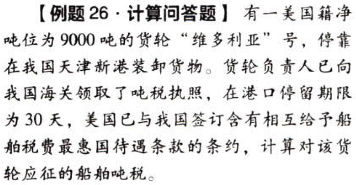

船舶吨税法.本章真题

# 1. 题目

【答案】
[查看解析和答案](media/b6f9d64a92e76240131c1c0761c7d81a.png.md)
# 2. 题目

【答案】
[查看解析和答案](media/4f7b37e2b8a0606bf6f419a8e629f057.png.md)
# 3. 题目

【答案】
[查看解析和答案](media/46f0145d657efcc8dabf9a38cc5a2afa.png.md)
# 4. 题目

【答案】
[查看解析和答案](media/9a6c914de45488d6c02a8ea2a15a20e3.png.md)

