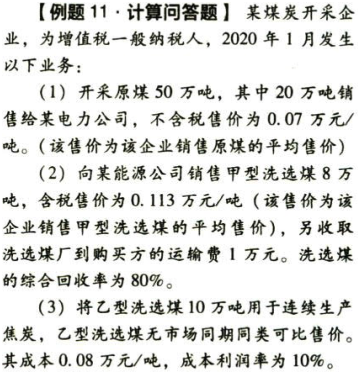

资源税法.本章真题

# 1. 题目

【答案】
[查看解析和答案](media/8f9f873a9965fb1dbc307a6f420ca4fa.png.md)
# 2. 题目

【答案】
[查看解析和答案](media/7cd906cc89fe2e35827cc51692661bca.png.md)
# 3. 题目

【答案】
[查看解析和答案](media/ec9319c02fd69953aae6554ecfba588e.png.md)
# 4. 题目

【答案】
[查看解析和答案](media/ac6d7349b891f5cc96376bcd7dab235e.png.md)
# 5. 题目

【答案】
[查看解析和答案](media/dc2e425bc91c26f98df3d62ec4ae1cde.png.md)
# 6. 题目

【答案】
[查看解析和答案](media/3f9607aae57eb8560696e5fb1c8ed65a.png.md)
# 7. 题目

【答案】
[查看解析和答案](media/09762e08b690cb32cb3468a5d86ce257.png.md)
# 8. 题目

【答案】
[查看解析和答案](media/f30b55a76ad3b6803ae47d8711993e0d.png.md)
# 9. 题目

【答案】
[查看解析和答案](media/a47e6deda2a1706dc10c874df81fe647.png.md)
# 10. 题目

【答案】
[查看解析和答案](media/38b83389d8405614eedc2d794a158333.png.md)
# 11. 题目

【答案】
[查看解析和答案](media/5c5a2333bdc9dc01f782f3acc9a95adb.png.md)
# 12. 题目

【答案】
[查看解析和答案](media/ee997af1419b6b0e792fb40e12c6933b.png.md)
# 13. 题目

【答案】
[查看解析和答案](media/a1c8b4de05fe6f846197f5b9eab7bbb2.png.md)
# 14. 题目

【答案】
[查看解析和答案](media/afc8847dac6424e0b9d5112031d96f58.png.md)
# 15. 题目

【答案】
[查看解析和答案](media/a8c1719fd0fec88628c95de66fb048e4.png.md)
# 16. 题目

【答案】
[查看解析和答案](media/cbb13dd731b0bb7efa9bb92897395c39.png.md)
# 17. 题目

【答案】
[查看解析和答案](media/d7608873197adf7a0bb2cd89b156f5f7.png.md)
# 18. 题目

【答案】
[查看解析和答案](media/1cba0bd87ae75183eb088f2303a3efaa.png.md)
# 19. 题目

【答案】
[查看解析和答案](media/9a87e2c155366d601aa9d27282869144.png.md)
# 20. 题目

【答案】
[查看解析和答案](media/170805efa2eda947176623c7f2cb2498.png.md)
# 21. 题目

【答案】
[查看解析和答案](media/c57493212a0468a8fcc3befd79ab08f7.png.md)
# 22. 题目

【答案】
[查看解析和答案](media/93b16c64e1ada89d138d50e11d2725c3.png.md)
# 23. 题目

【答案】
[查看解析和答案](media/a89e423cf069e48f883d82a10b3fd20b.png.md)
# 24. 题目（单选）

【答案】
[查看解析和答案](media/d45257921c6551ffc5259cf623933155.png.md)
# 25. 题目（多选）

【答案】
[查看解析和答案](media/516156f4409c41a3ec95d4f4b910729c.png.md)
# 26. 题目（多选）

【答案】
[查看解析和答案](media/acf434869a8d6e2285efecb0e6fb7be6.png.md)
# 27. 题目

【答案】
[查看解析和答案](media/629b6b82644fc6d3fd400d85425e55ec.png.md)

