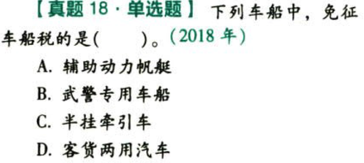

车船税法.本章真题

# 1. 题目

【答案】
[查看解析和答案](media/ca8ad372e2a48c435f8d62afe4686e34.png.md)
# 2. 题目

【答案】
[查看解析和答案](media/cf71f6c0cf85ca530ef0e14970e3c49c.png.md)
# 3. 题目

【答案】
[查看解析和答案](media/f875371a4e3e13bd9e932722559eb706.png.md)
# 4. 题目

【答案】
[查看解析和答案](media/7d409086f12edda62b89afd9c2652c27.png.md)
# 5. 题目

【答案】
[查看解析和答案](media/0361d80f6410e507d68790e54572aca6.png.md)
# 6. 题目

【答案】
[查看解析和答案](media/a26608a88434bd75f59d90005dbf041c.png.md)
# 7. 题目

【答案】
[查看解析和答案](media/72d90fbe1611ffb45e61a2353869c87f.png.md)
# 8. 题目

【答案】
[查看解析和答案](media/0917fded66fd3458016898e3480465bc.png.md)
# 9. 题目

【答案】
[查看解析和答案](media/6e85cb78a798edbd29e9bdb9c8e81ba0.png.md)
# 10. 题目（单选）

【答案】
[查看解析和答案](media/a6e9341542acc12addf1a67557e307f5.png.md)
# 11. 题目（多选）

【答案】
[查看解析和答案](media/b0f140be48223bf1a8fb3ab627e2cb55.png.md)

